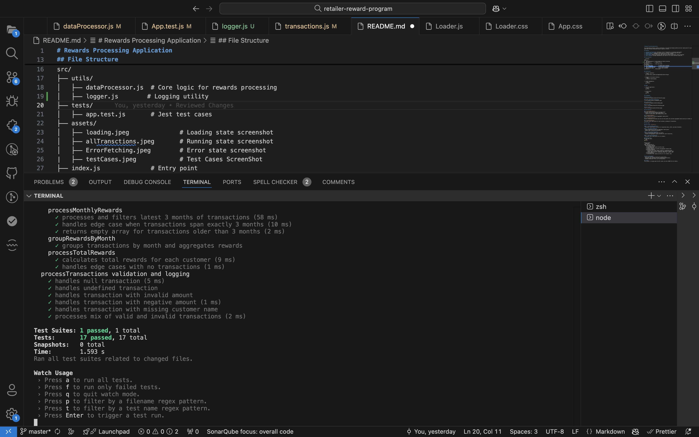

# Rewards Processing Application

This application processes customer transactions to calculate and display monthly and total reward points for each customer. It supports grouping rewards by month and filtering transactions based on specific criteria.

## Features

1. **Transaction Processing**: Processes a list of transactions to calculate reward points.
2. **Monthly Rewards**: Aggregates reward points by customer, grouped by month and year.
3. **Total Rewards**: Calculates total reward points for each customer.
4. **Filtering**: Ignores transactions older than three months during monthly reward processing.
5. **Unit Testing**: Includes comprehensive test cases for all utility functions using Jest.

## File Structure

```plaintext
src/
├── utils/
│   ├── dataProcessor.js  # Core logic for rewards processing
├── tests/
│   ├── app.test.js       # Jest test cases
├── assets/
│   ├── loading.jpeg              # Loading state screenshot
│   ├── allTransctions.jpeg       # Running state screenshot
│   ├── ErrorFetching.jpeg        # Error state screenshot
|   ├── testCases.jpeg            # Test Cases ScreenShot
├── index.js              # Entry point
```

## Installation

1. Clone the repository:
   ```bash
   git clone https://github.com/nagasai318/retailer-Project
   ```

2. Navigate to the project directory:
   ```bash
   cd retailer-reward-program
   ```

3. Install dependencies:
   ```bash
   npm install
   ```

## Usage

1. Start the application:
   ```bash
   npm start
   ```

2. Run the tests:
   ```bash
   npm test
   ```

## Screenshots

### Running State


### Latest Three Month Transactions 


### Loading State


### Error State


### Test Cases


## Core Functions

### `calculateRewardPoints`
Calculates reward points based on the amount spent:
- 2 points for every dollar spent above $100.
- 1 point for every dollar spent between $50 and $100.

### `groupRewardsByMonth`
Groups transactions by month and aggregates reward points.

### `processMonthlyRewards`
Filters transactions to include only the last three months and calculates aggregated reward points per customer per month.

### `processTotalRewards`
Calculates total reward points for each customer by summing all transactions.

## Test Cases

### Test Suite: `app.test.js`

#### 1. **calculateRewardPoints**
- Calculates reward points correctly for transactions below, within, and above thresholds.

#### 2. **groupRewardsByMonth**
- Groups transactions by month and aggregates reward points.
- Handles empty transactions gracefully.

#### 3. **processMonthlyRewards**
- Filters transactions older than three months.
- Processes and aggregates rewards correctly for valid transactions.

#### 4. **processTotalRewards**
- Calculates total reward points for all customers.

### Running Tests
Run the test suite:
```bash
npm test
```

Example Output:
```plaintext
PASS  tests/app.test.js
  Data Processor Functions
    calculateRewardPoints
      ✓ calculates reward points correctly (5ms)
    groupRewardsByMonth
      ✓ groups transactions by month and aggregates rewards (4ms)
    processMonthlyRewards
      ✓ processes and filters latest 3 months of transactions (3ms)
      ✓ handles edge case when transactions span exactly 3 months (2ms)
      ✓ returns empty array for transactions older than 3 months (1ms)
    processTotalRewards
      ✓ calculates total rewards correctly for all customers (2ms)
```

## Future Enhancements
- Add a user interface to visualize the reward points.
- Integrate with a database to store transactions persistently.
- Implement additional filters and sorting options.

## License
This project is licensed under the MIT License. See the LICENSE file for details.
